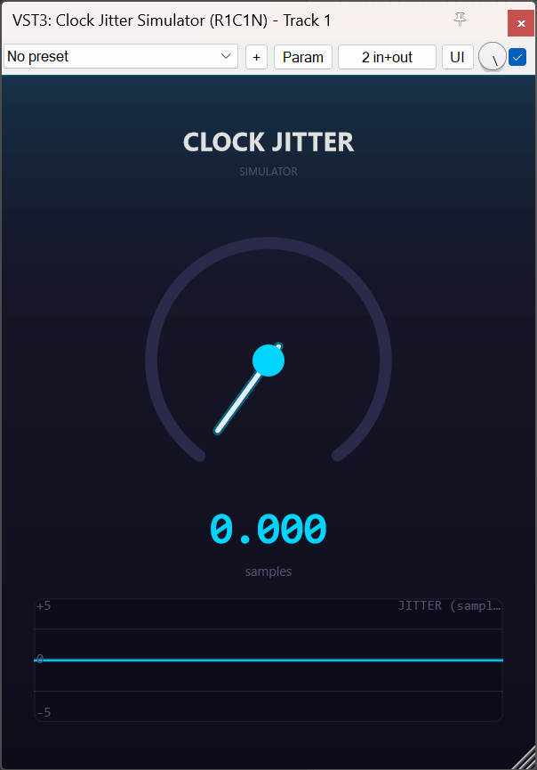

# Clock Jitter Simulator

**VST3 clock jitter effect plugin — high-accuracy sampling clock jitter simulation via selectable oversampling (50× / 100× / 250× / 1000×).**



---

## Features

| Feature | Detail |
|---|---|
| **Jitter range** | 0.000 – 10.000 samples |
| **Oversampling** | 50× / 100× / 250× / 1000× polyphase FIR (Blackman‑windowed sinc) |
| **Interpolation** | 4-point Catmull‑Rom cubic |
| **Anti‑aliasing** | 16th-order Butterworth IIR lowpass @ 0.9× Nyquist |
| **RNG** | 32‑bit LCG (uniform) |
| **UI** | Dark modern theme, cyan glow knob, real‑time jitter waveform |
| **Resizable** | Vector UI, 320×420 to 800×1000 |


Note: Jitter resolution depends on the oversampling rate. Each OS setting is labeled with its precision on the UI (top‑right corner). Higher OS rates give finer jitter quantization at the cost of CPU.

| OS Rate | Precision |
|---|---|
| 50× | ±0.02 samples |
| 100× | ±0.01 samples |
| 250× | ±0.004 samples |
| 1000× | ±0.001 samples |

---

## Format

| Format | File |
|---|---|
| **VST3** (JUCE C++) | `Source/` → compiled VST3 |

---

## DSP Pipeline

```
in → [N× polyphase FIR ↑] → OS ring buffer
                                    │
                          + random jitter (LCG)
                                    │
                     [Catmull‑Rom cubic read]
                                    │
                      [16th-order Butterworth LP]
                                    │
out ←────────────────────────────────┘
```

- Per‑channel 131072‑sample oversampled ring buffers
- Shared jitter offset per stereo pair (emulates a shared clock)
- N‑phase polyphase FIR with zero‑stuffing gain compensation (N = 50/100/250/1000)


---

## Building (VST3)

### Requirements

- **JUCE** 8.0.x
- **CMake** ≥ 3.22
- **MSVC 2022** (Windows) / Clang / GCC (MinGW is not supported by JUCE 8)


### Build

```bash
git clone https://github.com/Zeo33-free/ClockJitterSimulator.git
cd ClockJitterSimulator
cmake -B build -DJUCE_PATH="/path/to/JUCE"
cmake --build build --config Release
```

Output: `build/ClockJitterSim_artefacts/Release/VST3/Clock Jitter Simulator.vst3`

### Windows (MSVC)

```powershell
cmake -B build -DJUCE_PATH="/path/to/JUCE" -G "Visual Studio 17 2022"
cmake --build build --config Release --parallel
```

---

## Parameters

| Parameter | Range | Step | Skew | Default | Description |
|---|---|---|---|---|---|
| **Jitter** | 0.0 – 10.0 samples | 0.001 | 0.5 (log) | 0.0 | Clock jitter amplitude |
| **Oversampling** | 50× / 100× / 250× / 1000× | — | — | 50× | FIR interpolation rate (precision shown in UI) |


---

## Files

```
├── CMakeLists.txt
├── LICENSE
├── README.md
├── 1.png                      (screenshot)
└── Source/
    ├── PluginProcessor.h
    ├── PluginProcessor.cpp
    ├── PluginEditor.h
    └── PluginEditor.cpp
```


---

## Credits

- **DSP & plugin** — R1C1N
- **Framework** — [JUCE](https://juce.com/)
